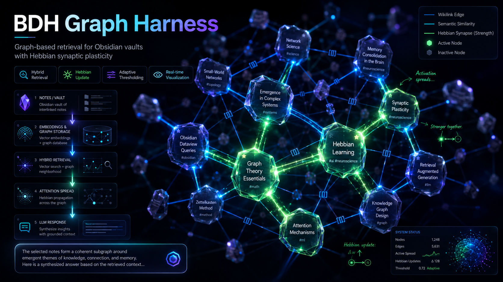

<p align="center">
  
</p>

# BDH Graph Harness

> **⚠️ Disclaimer**
> This is an **experimental research project** implementing biological neural network analogies (Hebbian plasticity, neurogenesis, sleep-cycle consolidation) on Obsidian vault graphs. It is **not production software** — API endpoints, configuration, and data formats may change without notice between versions.
>
> The theoretical foundation comes from the [Dragon Hatchling paper](https://arxiv.org/abs/2509.26507) (Kosowski et al., 2025). This implementation is an independent exploration of those ideas, not an official implementation of the paper.
>
> If you're looking for a stable knowledge management tool, consider [Obsidian](https://obsidian.md) + [Dataview](https://github.com/blacksmithgu/obsidian-dataview) or a mature RAG solution. This project is for people who want to experiment with bio-inspired graph learning.

## What it does

Turns an Obsidian vault into a living knowledge graph where:
- **Notes → neurons** — each note embedded with `nomic-embed-text-v2-moe` (768d, via Ollama) and stored in ChromaDB with `OllamaEmbeddingFunction`
- **Wikilinks → synapses** — graph edges from `[[wikilinks]]`
- **Hebbian learning** — co-activated notes strengthen their synaptic weight over time (frequency + recency + activation correlation)
- **Vector retrieval** — semantic search via embeddings (default). Optional BM25 hybrid mode for multilingual vaults (disabled by default — see `benchmarks/BM25_ANALYSIS.md`)
- **Adaptive thresholding** — `max(Q75, mean+1std, 0.15)` to filter noise dynamically
- **Neurogenesis** — LLM extracts new concepts from queries and creates notes in the vault, filtered by a 3-layer signal system (prompt engineering + regex blocklist + semantic dedup) to prevent noise
- **Node quality scoring** — composite score (strong edges + mean weight + frequency) auto-prunes dormant nodes from visualization; re-activates on strong re-encounter
- **Sleep-cycle consolidation** — periodic synaptic downscaling (×0.9), structural pruning below weight floor, and stale dormant node removal — mirrors biological sleep consolidation
- **Server-side file watcher** — mtime-based polling detects vault changes from any source (Obsidian, LLM, scripts) and triggers incremental graph updates
- **LLM responses** — any OpenAI-compatible provider (OpenRouter, Ollama Cloud, local Ollama), with citations back to source notes
- **Real-time visualization** — WebGL force-graph showing nodes activating, edges pulsing as Hebbian weights update during queries

For the theory behind these choices — why Hebbian plasticity, why Obsidian, why not just RAG — see [`docs/philosophy.md`](docs/philosophy.md).

## Neurogenesis Signal Filtering

Neurogenesis creates new notes from concepts the LLM identifies in its response. Without filtering, this generates ~50% noise (model names, internal plumbing, generic process words). Three layers ensure signal-first neurogenesis:

1. **Prompt engineering** — the system prompt explicitly instructs the LLM what to extract (algorithms, architectures, patterns, lessons) vs what to reject (model names, API providers, internal plumbing, generic words)
2. **Regex blocklist** — deterministic post-LLM filter catches model names (`glm-*`, `gemma*`, `mistral-*`, etc.), BDH plumbing (`graph-refresh`, `hebbian-update`, etc.), generic process words, and too-short slugs
3. **Semantic dedup** — ChromaDB cosine similarity (threshold 0.65) catches spelling variants and semantic duplicates that exact-string matching misses (e.g. `sleepcycle-consolidation` vs `sleep-cycle-consolidation`)

See [`bdh_graph_harness/neurogenesis/creator.py`](bdh_graph_harness/neurogenesis/creator.py) and [`dedupe.py`](bdh_graph_harness/neurogenesis/dedupe.py) for implementation.

## Architecture

```
Obsidian Vault → Embed (Ollama) → ChromaDB + Graph
                                    ↓
Query → Vector Search → Attention Spread (max_hop=2)
                                    ↓
Hebbian Update (co-activation strengthening) → LLM Response (OpenAI-compatible)
                                    ↓
WebSocket → force-graph (WebGL) (nodes light up, synapses pulse)

Sleep Cycle (periodic):
  Synaptic Downscaling (×0.9) → Prune (< floor) → Quality Re-eval → Stale Removal
```

## Package structure

```
bdh_graph_harness/
├── __main__.py              # CLI entry point (--serve, --mcp, --query, --refresh)
├── config.py                # Config loading, env var expansion, retry logic
├── mcp_server.py            # MCP server (FastMCP, stdio + HTTP transport)
├── graph/
│   ├── parser.py            # Frontmatter + wikilink parsing
│   ├── builder.py           # Graph construction + incremental cache
│   └── cache.py             # Graph cache serialization
├── retrieval/
│   ├── embeddings.py        # Ollama embedding client
│   ├── chroma_store.py      # ChromaDB vector store
│   ├── bm25.py              # BM25 lexical index (optional, disabled by default)
│   ├── hybrid.py            # Vector + BM25 fusion (optional, disabled by default)
│   └── attention.py         # Seed selection + k-hop spread + adaptive threshold
├── memory/
│   ├── hebbian.py           # Synaptic weight update + decay
│   ├── quality.py           # Node quality scoring + dormant pruning
│   ├── consolidation.py     # Sleep-cycle: downscaling + pruning + stale removal
│   └── state_store.py       # Persistent state (file-locked)
├── llm/
│   ├── providers.py         # LLM factory + payload builder
│   ├── ollama.py            # Ollama backend
│   ├── openrouter.py        # OpenRouter backend (OpenAI-compatible)
│   └── prompt.py            # System prompt + context formatting
├── neurogenesis/
│   ├── creator.py           # Concept extraction + note creation + noise filtering
│   └── dedupe.py            # Exact + semantic duplicate detection (ChromaDB cosine similarity)
├── api/
│   ├── server.py            # aiohttp app setup + WebSocket
│   ├── routes.py            # REST endpoints
│   ├── ws.py                # WebSocket handlers
│   └── watcher.py           # Server-side vault file watcher (mtime polling)
└── visualization/
    └── templates/index.html # force-graph (WebGL) real-time graph UI
```

`harness.py` is a compatibility shim that re-exports from the package — tests use `import harness`.

## Setup

1. **Ollama** running locally with `nomic-embed-text-v2-moe` pulled (for embeddings)
2. **LLM provider** — any OpenAI-compatible endpoint:
   - **OpenRouter**: set `OPENROUTER_API_KEY` env var (default config uses `openrouter/free`)
   - **Ollama Cloud**: set `OLLAMA_API_KEY` and point `openrouter_url` to `https://ollama.com/v1/chat/completions`
   - **Local Ollama**: switch `llm_provider: ollama` in config
   - Any other OpenAI-compatible API works — just set `openrouter_url`, `openrouter_key`, and `llm_model`
3. **Python 3.11+** with dependencies:

```bash
pip install -r requirements.txt
```

4. **Configure** the vault path:

```bash
cp bdh-config.yaml bdh-config.local.yaml
# Edit vault_path to point at your Obsidian vault
```

## Usage

```bash
# Start server
python -m bdh_graph_harness --serve

# Single query (CLI)
python -m bdh_graph_harness --query "come funziona l'apprendimento Hebbian?"

# Force graph rebuild
python -m bdh_graph_harness --refresh

# Open visualization
open http://localhost:8643
```

### Running as a service (macOS)

```bash
# Install launchd service
cp ai.bdh.graph-harness.plist ~/Library/LaunchAgents/
launchctl load ~/Library/LaunchAgents/ai.bdh.graph-harness.plist
```

The service auto-restarts on crash (`KeepAlive: true`). Logs at `~/.hermes/logs/bdh-server.log`. The `start-server.sh` wrapper exports `OPENROUTER_API_KEY` from `~/.hermes/.env` before launching.

## Config

See `bdh-config.yaml` for all parameters. Key ones:

| Parameter | Default | Description |
|-----------|---------|-------------|
| `seed_count` | 5 | Top-k embedding matches as seed nodes |
| `max_hop` | 2 | Graph traversal depth from seeds |
| `active_threshold` | 0.25 | Min activation score (overridden by adaptive) |
| `alpha` | 0.7 | Frequency weight in Hebbian |
| `beta` | 0.3 | Recency weight in Hebbian |
| `decay` | 0.95 | Per-session decay for unused synapses |
| `hybrid_search` | `false` | Enable BM25 hybrid mode (disabled by default for Italian vaults) |
| `hybrid_alpha` | 0.7 | Vector search weight (only when `hybrid_search: true`) |
| `hybrid_beta` | 0.3 | BM25 search weight (only when `hybrid_search: true`) |
| `llm_provider` | `openrouter` | `openrouter` (any OpenAI-compatible endpoint) or `ollama` (local) |
| `llm_model` | `openrouter/free` | Model name for chosen provider |
| `api_port` | 8643 | Server port |
| `quality_threshold` | 0.25 | Quality score below this → node marked dormant |
| `quality_reactivation_score` | 0.50 | Activation score to re-awaken a dormant node |
| `quality_prune_interval` | 50 | Re-evaluate node quality every N queries |
| `graph_ignore` | `[]` | fnmatch patterns to exclude nodes from the graph (e.g. `[".bdh-*"]`) |
| `consolidation_downscale_factor` | 0.90 | Global weight multiplier per sleep cycle |
| `consolidation_prune_weight_floor` | 0.02 | Delete synapses below this weight after downscaling |
| `consolidation_dormant_persist_cycles` | 3 | Remove nodes dormant for N+ consolidation cycles |
| `consolidation_prune_dormant_nodes` | `true` | Delete stale dormant nodes (not just hide) |

## Tests

```bash
pytest tests/ -v
```

180 tests covering graph building, attention spread, adaptive threshold, BM25, hybrid search (optional), Hebbian updates, LLM providers (Ollama + OpenAI-compatible), neurogenesis, consolidation (downscaling, pruning, stale removal), and API endpoints.

## Visualization

The web UI at `:8643` shows a real-time force-graph (WebGL) with:
- **Nodes** colored by activation state or by Obsidian tags (toggle)
- **Wikilink edges** + **Hebbian synapses** + **Phantom links** with hover tooltips (weight, type, connected notes)
- **Live neurogenesis** — new edges appear in real-time as concepts are created
- **Hover highlighting** — node hover shows 1-hop subgraph, edge hover highlights the edge
- **Node drag**, **viewport-preserving updates**, **manual collision force**
- **Z-order** — wikilinks (bottom) → phantom (middle) → hebbian (top)
- **Orphan nodes toggle**, **tag legend overlay**, **dark theme**, **mobile responsive** (iPhone safe area, touch dismiss)
- **Node quality** — dormant nodes dimmed (gray, 30% opacity) with 💤 tooltip; stats bar shows dormant count
- **Persisted controls** — slider values saved in localStorage, restored on refresh

See [`docs/visualization.md`](docs/visualization.md) for full details on controls, tooltips, and mobile support.

## MCP Server

The harness includes a [Model Context Protocol](https://modelcontextprotocol.io) server that exposes the Hebbian graph as tools to any MCP-compatible client (Claude Desktop, Cursor, Windsurf, Continue).

```bash
# stdio mode (Claude Desktop, Cursor)
python -m bdh_graph_harness --mcp

# HTTP mode (web clients)
python -m bdh_graph_harness --mcp --mcp-transport http --mcp-port 8644
```

**Tools:** `query` (grounded Q&A with citations), `stats` (graph overview), `hebbian` (learned synapses), `graph` (full network), `refresh` (rebuild embeddings).

The MCP server imports the package directly — no dependency on the HTTP API server. Both can run independently or simultaneously.

See [`docs/mcp-server.md`](docs/mcp-server.md) for client configuration (Claude Desktop, Cursor, etc.).

## Hermes Agent integration

### bdh-hermes-bridge plugin (recommended)

The **[bdh-hermes-bridge](https://github.com/albidev/bdh-hermes-bridge)** plugin provides bidirectional integration between [Hermes Agent](https://github.com/NousResearch/hermes-agent) and BDH:

- **Write path** — every Hermes response (>200 chars) is fed to BDH, triggering Hebbian reinforcement and neurogenesis from real usage
- **Read path** — `bdh_query` tool lets Hermes pull context from the knowledge graph on demand
- **Echo-loop dampening** — assistant responses are flagged with `source: "assistant_response"` to prevent feedback amplification
- **User context capture** — original user prompt is included in write payloads, enabling proper question→answer synaptic associations

```bash
# Install
git clone https://github.com/albidev/bdh-hermes-bridge.git ~/.hermes/plugins/bdh-hermes-bridge

# Enable in ~/.hermes/config.yaml
plugins:
  enabled:
    - bdh-hermes-bridge
```

### Hermes skill (CLI)

The harness also ships with a [Hermes Agent](https://hermes-agent.nousresearch.com) skill that lets you query the graph from chat. The skill definition is in [`docs/hermes-skill.md`](docs/hermes-skill.md) — copy it to `~/.hermes/skills/research/bdh-graph-harness/SKILL.md` to activate it.

Once installed, your Hermes agent can:
- Query the graph via natural language ("bdh query: how does Hebbian learning work?")
- Show graph stats and Hebbian synaptic state
- Start/stop the API server
- Present answers with source citations

## Obsidian Sync Plugin

Auto-sync vault changes to the BDH server via an Obsidian plugin — no manual refresh needed.

```
Obsidian edit → Plugin detects → Debounce 1s → POST /api/node-update
    → Server diffs graph → WebSocket broadcast → Viz updates in real-time
```

**Setup:**
1. Build the plugin: `cd plugins/obsidian && npm install && npm run build`
2. Copy `manifest.json` + `main.js` to your vault's `.obsidian/plugins/bdh-graph-harness-sync/`
3. Enable "BDH Graph Harness Sync" in Obsidian Settings → Community Plugins

**Features:**
- Debounced updates (1s, configurable) — no server spam
- Status bar indicator (○ idle, ◎ syncing, ● ok, ✗ error)
- Ignores non-`.md` files and `.obsidian/` directory
- Configurable server URL, debounce delay, enable/disable

**Pulse animation:** Hebbian edges get animated particles during query — color transitions from green through blue, particle count scales with weight gain. Activation state is managed via external Maps to avoid mutating force-graph's live objects.

## Sleep-Cycle Consolidation

Periodic graph maintenance that mirrors biological sleep consolidation. Run it manually or schedule it (e.g. nightly via cron):

```bash
# Trigger a consolidation cycle
curl -X POST http://localhost:8643/api/consolidate

# Dry run (see what would change without committing)
curl -X POST http://localhost:8643/api/consolidate -H "Content-Type: application/json" -d '{"dry_run": true}'

# View config and cycle count
curl http://localhost:8643/api/consolidation-stats
```

**Cycle steps:**
1. **Synaptic downscaling** — multiply all Hebbian weights by `consolidation_downscale_factor` (default 0.90). Prevents runaway strengthening.
2. **Structural pruning** — delete synapses with weight below `consolidation_prune_weight_floor` (default 0.02) after downscaling.
3. **Quality re-evaluation** — recalculate node quality scores and update dormant state.
4. **Stale removal** — delete nodes dormant for more than `consolidation_dormant_persist_cycles` (default 3) consecutive cycles, if `consolidation_prune_dormant_nodes` is true.

No tokens consumed — pure algorithmic operation on the local graph state. Safe to run while the server is serving queries (file-locked state access).

## License

MIT