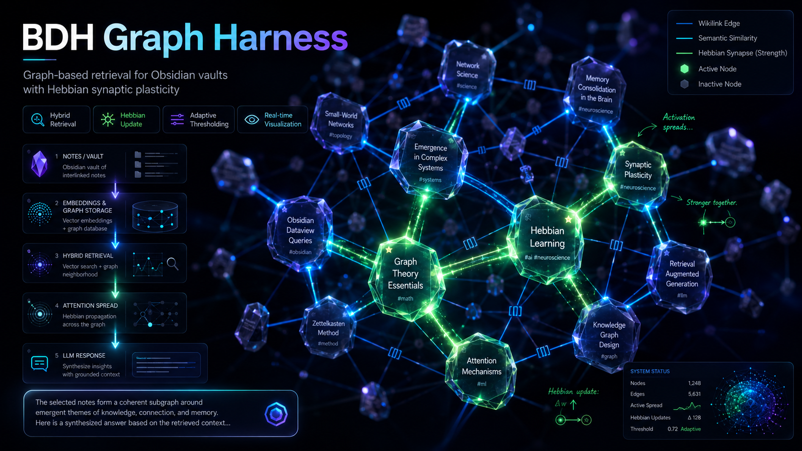

<p align="center">
  
</p>

# BDH Graph Harness

> **A living memory system for Obsidian vaults and AI agents.**
>
> BDH turns Markdown notes into a queryable, self-maintaining knowledge graph. It combines explicit structure (wikilinks), semantic retrieval (embeddings + optional BM25), learned associations (Hebbian dynamic edges), and maintenance cycles that prune noise and consolidate useful structure over time.

This is **not a RAG wrapper with a graph visualizer glued on**. Retrieval, learning, ingestion, quality control, consolidation, and agent interfaces are separate but connected subsystems. The graph changes as the vault changes and as it is used.

> **⚠️ Experimental research software.** APIs, configuration, and storage formats may change. The project independently explores ideas from the [Dragon Hatchling paper](https://arxiv.org/abs/2509.26507) (Kosowski et al., 2025); it is not an official implementation.

## System at a glance

| Layer | What BDH does |
|---|---|
| **Ingest** | Watches Obsidian and optional read-only external Markdown sources; incrementally rebuilds graph, embeddings, and lexical indexes. |
| **Connect** | Preserves explicit wikilinks, resolves federated source IDs, and adds bounded phantom links for validated semantic proximity. |
| **Retrieve** | Combines vector/BM25 seed selection, multi-query fusion, adaptive attention spread, and provenance-rich results. |
| **Learn** | Strengthens co-activated notes with Hebbian plasticity; trusted learned-only edges can extend traversal beyond declared links. |
| **Maintain** | Scores node quality, marks dormant material, runs sleep-cycle downscaling/pruning, and refreshes structural relationships. |
| **Grow** | Extracts genuinely useful concepts through filtered neurogenesis with provenance and semantic deduplication. |
| **Expose** | Serves REST, WebSocket visualization, CLI, and MCP tools to humans and AI agents. |

## Knowledge lifecycle

```text
Obsidian vault + federated Markdown sources
                  │
                  ▼
    watcher → source-aware graph + Chroma + BM25
                  │
                  ▼
query → hybrid seeds → attention traversal → cited context / response
                  │                      │
                  │                      └─ static + trusted dynamic Hebbian edges
                  ▼
Hebbian plasticity → neurogenesis (filtered) → incremental watcher update
                  │
                  ▼
sleep-cycle consolidation → downscale → prune → quality re-evaluation → phantom refresh
```

## Core capabilities

- **Semantic + structural retrieval** — Chroma embeddings, optional BM25/RRF, multi-query fusion, adaptive thresholds, and k-hop graph attention with per-note provenance.
- **Trusted dynamic Hebbian edges** — repeated co-activation creates learned relations that can improve reachability without mutating the declared wikilink graph. Frequency, consolidation, and recency produce an explicit trust factor; dynamic-only results are shadow-instrumented without storing query text.
- **Federated, multi-vault knowledge** — independent vault contexts prevent state or embedding contamination. Read-only external Markdown sources use source-aware IDs and can participate in cross-source links.
- **Continuous ingestion** — a debounced, source-aware watcher handles vault edits and external-source updates incrementally instead of requiring manual full rebuilds.
- **Quality and consolidation** — node quality detects dormant material; scheduled sleep cycles downscale, prune stale weak synapses, remove persistent dormant nodes, and refresh phantom relationships.
- **Controlled neurogenesis** — LLM-generated concepts pass prompt constraints, deterministic blocklists, semantic deduplication, and source-provenance checks before becoming notes.
- **Agent-native interfaces** — REST API, WebSocket event stream, CLI, and MCP server all use the same core retrieval and memory model.
- **Inspectable visualization** — a WebGL force graph renders activation, edge families, learned strength, dormant state, and live updates.

## Documentation map

| Need | Read |
|---|---|
| Why this architecture exists | [`docs/philosophy.md`](docs/philosophy.md) |
| Learned dynamic-edge contract, trust, telemetry, and evaluation limits | [`docs/hebbian-dynamic-edges.md`](docs/hebbian-dynamic-edges.md) |
| MCP clients and transports | [`docs/mcp-server.md`](docs/mcp-server.md) |
| Real-time graph visualization | [`docs/visualization.md`](docs/visualization.md) |
| Testing and coverage policy | [`docs/testing.md`](docs/testing.md) |
| Configurable behavior | [`bdh-config.yaml`](bdh-config.yaml) |

## Neurogenesis Signal Filtering

Neurogenesis creates new notes from concepts the LLM identifies in its response. Without filtering, this generates ~50% noise (model names, internal plumbing, generic process words). Three layers ensure signal-first neurogenesis:

1. **Prompt engineering** — the system prompt explicitly instructs the LLM what to extract (algorithms, architectures, patterns, lessons) vs what to reject (model names, API providers, internal plumbing, generic words)
2. **Regex blocklist** — deterministic post-LLM filter catches model names (`glm-*`, `gemma*`, `mistral-*`, etc.), BDH plumbing (`graph-refresh`, `hebbian-update`, etc.), generic process words, and too-short slugs
3. **Semantic dedup** — ChromaDB cosine similarity (threshold 0.65) catches spelling variants and semantic duplicates that exact-string matching misses (e.g. `sleepcycle-consolidation` vs `sleep-cycle-consolidation`)

See [`bdh_graph_harness/neurogenesis/creator.py`](bdh_graph_harness/neurogenesis/creator.py) and [`dedupe.py`](bdh_graph_harness/neurogenesis/dedupe.py) for implementation.

## Architecture

```
Obsidian Vault → Embed (Ollama) → ChromaDB + Graph
                                    ↓
Query → Vector Search → Attention Spread (max_hop=2)
                                    ↓
Hebbian Update (co-activation strengthening) → LLM Response (OpenAI-compatible)
                                    ↓
WebSocket → force-graph (WebGL) (nodes light up, synapses pulse)

Sleep Cycle (periodic):
  Synaptic Downscaling (×0.9) → Stale-Weak Pruning → Prune (< floor) → Quality Re-eval → Stale Removal
```

## Package structure

```
bdh_graph_harness/
├── __main__.py              # CLI entry point (--serve, --mcp, --query, --refresh)
├── config.py                # Config loading, env var expansion, retry logic
├── vaults.py                # VaultConfig, VaultContext, VaultRegistry (multi-vault isolation)
├── mcp_server.py            # MCP server (FastMCP, stdio + HTTP transport)
├── graph/
│   ├── parser.py            # Frontmatter + wikilink parsing
│   ├── builder.py           # Legacy graph construction + incremental cache
│   ├── sources.py           # Vault/external Markdown source scanners
│   ├── federated.py         # Source-aware IDs + federated graph builder
│   └── cache.py             # Graph cache serialization
├── okf/
│   └── export.py            # OKF v0.2 validator + sanitized bundle exporter
├── retrieval/
│   ├── embeddings.py        # Ollama embedding client
│   ├── chroma_store.py      # ChromaDB vector store
│   ├── bm25.py              # BM25 lexical index (optional, disabled by default)
│   ├── hybrid.py            # Vector + BM25 fusion (optional, disabled by default)
│   └── attention.py         # Seed selection + k-hop spread + adaptive threshold
├── memory/
│   ├── hebbian.py           # Synaptic weight update + decay
│   ├── quality.py           # Node quality scoring + dormant pruning
│   ├── consolidation.py     # Sleep-cycle: downscaling + pruning + stale removal
│   └── state_store.py       # Persistent state (file-locked)
├── llm/
│   ├── providers.py         # LLM factory + payload builder
│   ├── ollama.py            # Ollama backend
│   ├── openrouter.py        # OpenRouter backend (OpenAI-compatible)
│   └── prompt.py            # System prompt + context formatting
├── neurogenesis/
│   ├── creator.py           # Concept extraction + note creation + noise filtering + source provenance IDs
│   └── dedupe.py            # Exact + semantic duplicate detection (ChromaDB cosine similarity)
├── api/
│   ├── server.py            # aiohttp app setup + WebSocket
│   ├── routes.py            # REST endpoints
│   ├── ws.py                # WebSocket handlers
│   └── watcher.py           # Source-aware polling watcher with debounce
└── visualization/
    └── templates/           # 3D force-graph (WebGL) real-time graph UI + controls + WebSocket
```

`harness.py` is a compatibility shim that re-exports from the package — tests use `import harness`.

## Setup

1. **Ollama** running locally with `nomic-embed-text-v2-moe` pulled (for embeddings)
2. **LLM provider** — any OpenAI-compatible endpoint:
   - **OpenRouter**: set `OPENROUTER_API_KEY` env var (default config uses `openrouter/free`)
   - **Ollama Cloud**: set `OLLAMA_API_KEY` and point `openrouter_url` to `https://ollama.com/v1/chat/completions`
   - **Local Ollama**: switch `llm_provider: ollama` in config
   - Any other OpenAI-compatible API works — just set `openrouter_url`, `openrouter_key`, and `llm_model`
3. **Python 3.11+** with dependencies:

```bash
pip install -r requirements.txt
```

4. **Configure** the vault path:

```bash
cp bdh-config.yaml bdh-config.local.yaml
# Edit vault_path to point at your Obsidian vault
```

## Usage

```bash
# Start server
python -m bdh_graph_harness --serve

# Single query (CLI)
python -m bdh_graph_harness --query "come funziona l'apprendimento Hebbian?"

# Force graph rebuild
python -m bdh_graph_harness --refresh

# Read-only source scan (no ChromaDB, embeddings, LLM, or writes)
python -m bdh_graph_harness --config bdh-config.local.yaml --scan-sources
```

### OKF read compatibility

BDH can read the [Open Knowledge Format (OKF) v0.2](https://github.com/GoogleCloudPlatform/knowledge-catalog/blob/main/okf/SPEC.md) document conventions without replacing its runtime graph. Enable the read adapter in `bdh-config.local.yaml`:

```yaml
okf_mode: read
```

`okf_mode` is `false` by default. In `read` mode BDH parses typed YAML metadata, preserves unknown fields under `node["okf"]`, resolves local Markdown links alongside Obsidian wikilinks, ignores external URLs as graph edges, and keeps `index.md`/`log.md` out of the neuron graph. Hebbian synapses, embeddings, consolidation state, and neurogenesis runtime metadata remain BDH-owned and are not converted into OKF links.

The exporter and validator are separate from the vault read path. They write a new bundle and never rewrite the source vault:

```python
from bdh_graph_harness import build_graph
from bdh_graph_harness.okf import export_okf_bundle, validate_okf_bundle

nodes, edges = build_graph("/path/to/vault", use_cache=False, okf_mode=True)
export_okf_bundle(nodes, edges, "/tmp/bdh-okf-bundle")
result = validate_okf_bundle("/tmp/bdh-okf-bundle")
assert result.valid, result.errors
```

The bundle contains typed concept documents plus conformant root `index.md` and `log.md`. Only OKF document metadata and structural links are exported; Hebbian/phantom edges, activation history, embeddings, and local filesystem paths are excluded or redacted. Broken links and unknown `type` values remain valid according to OKF v0.2's permissive consumer contract.

```bash
# Open visualization
open http://localhost:8643

# List configured vaults (multi-vault mode)
python -m bdh_graph_harness --list-vaults

# Target a configured vault from the CLI
python -m bdh_graph_harness --vault-id research --stats
```

### Multi-vault API

Keep the legacy `vault_path` config for one vault, or use the `vaults:` list shown in [`bdh-config.yaml`](bdh-config.yaml). Each entry is isolated: it has its own graph, Hebbian state, watcher, BM25 index, lock, and ChromaDB collection.

```bash
# Query one vault explicitly
curl -X POST http://localhost:8643/api/query \
  -H 'Content-Type: application/json' \
  -d '{"vault_id":"research","query":"How does retrieval work?"}'

# Read stats for one vault, or discover configured vaults
curl 'http://localhost:8643/api/stats?vault_id=research'
curl http://localhost:8643/api/vaults
```

`vault_id` is also accepted by MCP tools such as `query(question="...", vault_id="research")`. Omitting it selects `default_vault` (or the first configured vault).

### Per-vault LLM routing

The top-level `llm_provider`, `llm_model`, `llm_base_url`, and `llm_api_key` values remain the global defaults. A vault can override them with a nested `llm` block without mutating or affecting any other vault:

```yaml
vaults:
  - id: crossnection
    name: Crossnection
    path: /path/to/Crossnection
    llm:
      provider: ollama
      model: gemma4:26b-mlx
      base_url: http://127.0.0.1:11434
      timeout: 300
      local_only: true

  - id: core
    name: Hermes Core
    path: /path/to/Hermes
    # No llm block: inherits the global provider/model configuration.
```

Supported nested fields are `provider`, `model`, `base_url`, `temperature`, `max_ctx`, `max_tokens`, `timeout`, `api_key`, `api_key_env`, and `local_only`. Prefer `api_key_env` for cloud vaults; credentials are resolved from the process environment and are never required in the YAML. `base_url` maps to the native Ollama host for `ollama` and to the OpenAI-compatible base for `ollama-cloud`/`openrouter`. `local_only: true` is a hard privacy gate: it accepts only the `ollama` provider and loopback endpoints (`localhost`, `127.0.0.1`, or `::1`).

The effective provider is resolved per request for REST, streaming, MCP, CLI, and neurogenesis paths. `GET /api/stats?vault_id=...` exposes the selected provider, model, transport, and endpoint for verification.

### Multi-query retrieval

When `multi_query_enabled: true` in config, clients can send `query_variants` alongside the primary query. The server retrieves seed candidates for each variant, merges them via reciprocal-rank fusion (RRF) or weighted-max, then performs one canonical graph expansion for the primary query. It returns canonical notes with per-note provenance (`matched_by`, `variant_hits`). This lets callers explore a query from multiple angles (e.g. Italian + English rewrites, paraphrases, keyword decompositions) in a single round-trip. The feature is opt-in; when disabled, supplied variants are ignored and the legacy single-query path is used.

```bash
# Multi-query: fan out across variant rewrites
curl -X POST http://localhost:8643/api/query \
  -H 'Content-Type: application/json' \
  -d '{
    "query": "How does retrieval work?",
    "query_variants": [
      {"query": "How does retrieval work?", "language": "en"},
      {"query": "Come funziona il retrieval?", "language": "it"}
    ]
  }'
```

The `routing` object in the response always includes these contract fields regardless of path:

| Field | Description |
|-------|-------------|
| `multi_query_enabled` | Whether multi-query was active for this request |
| `multi_query_variant_count` | Number of variants actually evaluated (1 when no variants) |
| `query_variants` | Array of variant objects (`query`, `language`, `weight`) |
| `multi_query_fusion` | Fusion strategy used (`'rrb'`, `'weighted'`, or `null`) |
| `multi_query_unique_notes` | Count of distinct notes returned |
| `multi_query_multivariant_hits` | Notes matched by 2+ variants (0 for single-query) |

### Running as a service (macOS)

```bash
# Install launchd service
cp ai.bdh.graph-harness.plist ~/Library/LaunchAgents/
launchctl load ~/Library/LaunchAgents/ai.bdh.graph-harness.plist
```

The service auto-restarts on crash (`KeepAlive: true`). Logs at `~/.hermes/logs/bdh-server.log`. The `start-server.sh` wrapper loads the configured provider credential from the environment (`OLLAMA_API_KEY`, `OPENROUTER_API_KEY`, or `OPENCODE_ZEN_API_KEY`) before launching.

## Config

See `bdh-config.yaml` for all parameters. Key ones:

| Parameter | Default | Description |
|-----------|---------|-------------|
| `seed_count` | 5 | Top-k embedding matches as seed nodes |
| `max_hop` | 2 | Graph traversal depth from seeds |
| `active_threshold` | 0.25 | Min activation score (overridden by adaptive) |
| `alpha` | 0.7 | Frequency weight in Hebbian |
| `beta` | 0.3 | Recency weight in Hebbian |
| `decay` | 0.95 | Per-session decay for unused synapses |
| `hybrid_search` | `false` | Enable BM25 hybrid mode (disabled by default for Italian vaults) |
| `hybrid_alpha` | 0.7 | Vector search weight (only when `hybrid_search: true`) |
| `hybrid_beta` | 0.3 | BM25 search weight (only when `hybrid_search: true`) |
| `llm_provider` | `ollama` | `ollama` (local), `ollama-cloud`, or `openrouter` (OpenAI-compatible endpoints) |
| `llm_model` | `gemma4:12b-mlx` | Model name for chosen provider |
| `llm_base_url` | — | OpenAI-compatible base URL for `ollama-cloud` |
| `llm_api_key` | — | Environment-expanded credential for the selected provider |
| `api_port` | 8643 | Server port |
| `quality_threshold` | 0.25 | Quality score below this → node marked dormant |
| `quality_reactivation_score` | 0.50 | Activation score to re-awaken a dormant node |
| `quality_prune_interval` | 50 | Re-evaluate node quality every N queries |
| `graph_ignore` | `[]` | fnmatch patterns to exclude nodes from the graph (e.g. `[".bdh-*"]`) |
| `external_sources` | `[]` | Read-only Markdown sources with per-source `include`/`exclude` glob lists; optional explicit `counterparts` link vault/external anchor notes |
| `consolidation_downscale_factor` | 0.90 | Global weight multiplier per sleep cycle |
| `consolidation_prune_weight_floor` | 0.02 | Delete synapses below this weight after downscaling |
| `consolidation_weak_weight_threshold` | 0.15 | Weak-tail threshold for stale-weak retention (not an online creation threshold) |
| `consolidation_weak_max_frequency` | 1.0 | Stale weak traces above this frequency survive |
| `consolidation_weak_min_age_hours` | 48 | Fresh weak traces get a grace period before pruning |
| `neurogenesis_source_edges_enabled` | `true` | Materialize validated `neurogenesis_source` generated edges from `activated_from_ids` frontmatter |
| `multi_query_enabled` | `false` | Enable multi-query fan-out; when `false`, `query_variants` in requests are silently ignored |
| `multi_query_max_variants` | 3 | Hard cap on evaluated variants per request (after dedup and empty-drop) |
| `hebbian_dynamic_edges_enabled` | `true` | Traverse eligible learned-only relations alongside static adjacency |
| `hebbian_dynamic_min_weight` | 0.15 | Ignore learned dynamic edges below this weight |
| `hebbian_dynamic_top_n` | 3 | Maximum learned candidates considered per active note |
| `hebbian_dynamic_gain` | 1.5 | Score multiplier for learned-only traversal |
| `hebbian_dynamic_hop_decay` | 0.6 | Per-hop decay for learned-only traversal |
| `hebbian_dynamic_shadow_enabled` | `true` | Emit privacy-safe telemetry when dynamic-only results are recovered |
| `consolidation_dormant_persist_cycles` | 3 | Remove nodes dormant for N+ consolidation cycles |
| `consolidation_prune_dormant_nodes` | `true` | Delete stale dormant nodes (not just hide) |

## Tests

```bash
# Install runtime + test tooling
pip install -r requirements-dev.txt

# Full suite
python -m pytest -q

# Include statement and branch coverage
python -m pytest -q --cov=bdh_graph_harness --cov-branch --cov-report=term-missing
```

`develop` currently verifies **377 passing tests**. The suite includes regression coverage for multi-query retrieval, API contracts, provenance, WebSocket ordering, the retrieval inspector UI, and trusted dynamic Hebbian traversal.

See [`docs/testing.md`](docs/testing.md) for the coverage policy, exact commands, and multi-vault regression requirements. [`docs/coverage.md`](docs/coverage.md) records the current versioned baseline; GitHub Actions keeps the XML and JSON report for every later `develop` or `main` run.

## Visualization

The web UI at `:8643` shows a real-time force-graph (WebGL) with:
The web UI at `:8643` shows a real-time **3D force-graph** (WebGL via [3d-force-graph](https://github.com/vasturiano/3d-force-graph)) with:
- **3D node rendering** — Three.js objects with custom geometries, label sprites, rings, and dashed semantic links
- **Nodes** colored by activation state or by Obsidian tags (toggle); neurogenesis nodes use aqua (`#00E5FF`)
- **Wikilink edges** + **Hebbian synapses** + **Phantom links** + **Counterpart/project-context edges** + **Neurogenesis source edges** with hover tooltips (weight, type, connected notes)
- **Live neurogenesis** — new edges appear in real-time as concepts are created; provenance edges connect newborn notes to their source nodes
- **Hover highlighting** — node hover shows 1-hop subgraph, edge hover highlights the edge
- **Node drag**, **viewport-preserving updates**, **camera-preserving structural updates**, and touch-first mobile graph interactions
- **Z-order** — wikilinks (bottom) → phantom (middle) → hebbian (top)
- **Orphan nodes toggle**, **tag legend overlay**, **dark theme**, **mobile responsive** (iPhone safe area, touch dismiss, tab-based layout)
- **Node quality** — dormant nodes dimmed (gray, 30% opacity) with 💤 tooltip; stats bar shows dormant count and Hebbian tail metrics
- **Persisted controls** — slider values saved in localStorage, restored on refresh
- **Hebbian tail metrics** — `hebbian_strong_synapses`, `hebbian_weak_synapses`, `hebbian_stale_weak_synapses` exposed via `/api/stats`
- **Query-response WebSocket event** — final ordered event after LLM response so plugin-launched queries are visible in the graph UI

See [`docs/visualization.md`](docs/visualization.md) for full details on controls, tooltips, and mobile support.
See [`docs/visualization-3d-migration.md`](docs/visualization-3d-migration.md) for the 3D migration architecture, lifecycle, and validation details.

## MCP Server

The harness includes a [Model Context Protocol](https://modelcontextprotocol.io) server that exposes the Hebbian graph as tools to any MCP-compatible client (Claude Desktop, Cursor, Windsurf, Continue).

```bash
# stdio mode (Claude Desktop, Cursor)
python -m bdh_graph_harness --mcp

# HTTP mode (web clients)
python -m bdh_graph_harness --mcp --mcp-transport http --mcp-port 8644
```

**Tools:** `query` (grounded Q&A with citations), `stats` (graph overview), `hebbian` (learned synapses), `graph` (full network), `refresh` (rebuild embeddings).

The MCP server imports the package directly — no dependency on the HTTP API server. Both can run independently or simultaneously.

See [`docs/mcp-server.md`](docs/mcp-server.md) for client configuration (Claude Desktop, Cursor, etc.).

## Hermes Agent integration

### bdh-hermes-bridge plugin (recommended)

The **[bdh-hermes-bridge](https://github.com/albidev/bdh-hermes-bridge)** plugin provides bidirectional integration between [Hermes Agent](https://github.com/NousResearch/hermes-agent) and BDH:

- **Write path** — every Hermes response (>200 chars) is fed to BDH, triggering Hebbian reinforcement and neurogenesis from real usage
- **Read path** — `bdh_query` tool lets Hermes pull context from the knowledge graph on demand
- **Echo-loop dampening** — assistant responses are flagged with `source: "assistant_response"` to prevent feedback amplification
- **User context capture** — original user prompt is included in write payloads, enabling proper question→answer synaptic associations

```bash
# Install
git clone https://github.com/albidev/bdh-hermes-bridge.git ~/.hermes/plugins/bdh-hermes-bridge

# Enable in ~/.hermes/config.yaml
plugins:
  enabled:
    - bdh-hermes-bridge
```

### Hermes skill (CLI)

The harness also ships with a [Hermes Agent](https://hermes-agent.nousresearch.com) skill that lets you query the graph from chat. The skill definition is in [`docs/hermes-skill.md`](docs/hermes-skill.md) — copy it to `~/.hermes/skills/research/bdh-graph-harness/SKILL.md` to activate it.

Once installed, your Hermes agent can:
- Query the graph via natural language ("bdh query: how does Hebbian learning work?")
- Show graph stats and Hebbian synaptic state
- Start/stop the API server
- Present answers with source citations

## Obsidian Sync Plugin

Auto-sync vault changes to the BDH server via an Obsidian plugin — no manual refresh needed.

```
Obsidian edit → Plugin detects → Debounce 1s → POST /api/node-update
    → Server diffs graph → WebSocket broadcast → Viz updates in real-time
```

**Setup:**
1. Build the plugin: `cd plugins/obsidian && npm install && npm run build`
2. Copy `manifest.json` + `main.js` to your vault's `.obsidian/plugins/bdh-graph-harness-sync/`
3. Enable "BDH Graph Harness Sync" in Obsidian Settings → Community Plugins

**Features:**
- Debounced updates (1s, configurable) — no server spam
- Status bar indicator (○ idle, ◎ syncing, ● ok, ✗ error)
- Ignores non-`.md` files and `.obsidian/` directory
- Configurable server URL, debounce delay, enable/disable

**Pulse animation:** Hebbian edges get animated particles during query — color transitions from green through blue, particle count scales with weight gain. Activation state is managed via external Maps to avoid mutating force-graph's live objects.

## Sleep-Cycle Consolidation

Periodic graph maintenance that mirrors biological sleep consolidation. Run it manually or schedule it (e.g. nightly via cron):

```bash
# Trigger a consolidation cycle
curl -X POST http://localhost:8643/api/consolidate

# Dry run (see what would change without committing)
curl -X POST http://localhost:8643/api/consolidate -H "Content-Type: application/json" -d '{"dry_run": true}'

# View config and cycle count
curl http://localhost:8643/api/consolidation-stats
```

**Cycle steps:**
1. **Synaptic downscaling** — multiply all Hebbian weights by `consolidation_downscale_factor` (default 0.90). Prevents runaway strengthening.
2. **Stale-weak pruning** — delete synapses that are below `consolidation_weak_weight_threshold` (default 0.15), have frequency ≤ `consolidation_weak_max_frequency` (default 1.0), and were last co-activated more than `consolidation_weak_min_age_hours` (default 48) ago. Fresh and frequently reinforced weak synapses survive.
3. **Structural pruning** — delete synapses with weight below `consolidation_prune_weight_floor` (default 0.02) after downscaling.
4. **Quality re-evaluation** — recalculate node quality scores and update dormant state.
5. **Stale removal** — delete nodes dormant for more than `consolidation_dormant_persist_cycles` (default 3) consecutive cycles, if `consolidation_prune_dormant_nodes` is true.

No tokens consumed — pure algorithmic operation on the local graph state. Safe to run while the server is serving queries (file-locked state access).

## Graph Quality Audit

A read-only audit script is available to check structural and Hebbian invariants without mutating state:

```bash
python scripts/audit_graph_quality.py --url http://localhost:8643
```

Reports: node count, structural edges, invalid endpoints, self-loops, duplicate edges, Hebbian tail classification (strong/weak/stale-weak), generated edge types, and source distribution.

## License

MIT